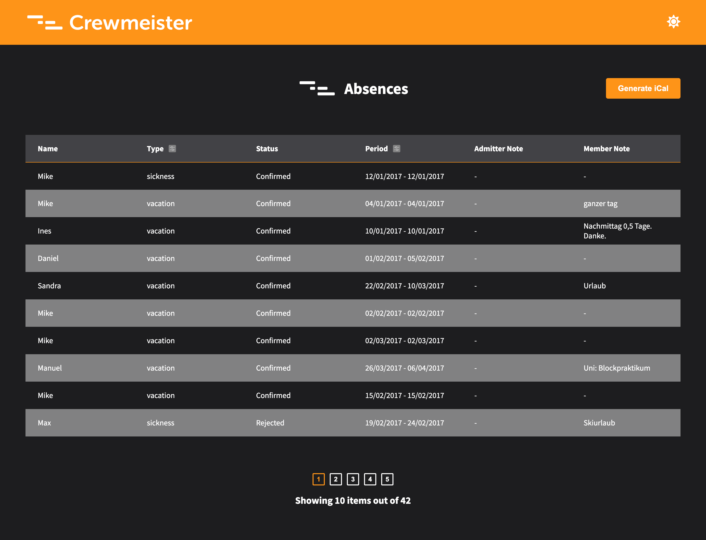
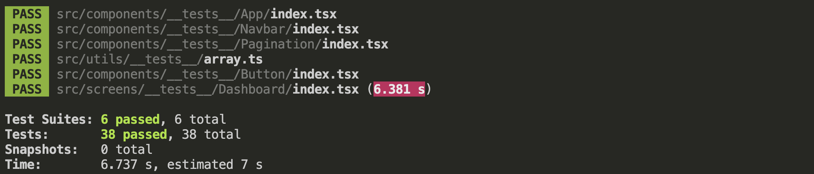

# 🚀 Crewmeister Challenge

This project was bootstrapped with [Create React App](https://github.com/facebook/create-react-app). Read the readme for further instructions on running the project, project's conventions, tech stack, tech decisions.

## Summary

- [Context](#Context)
- [Tech Stack](#💻-tech-stack)
- [Product Requirements](#📝-product-requirements)
- [Enhancements](#🪄-enhancements)
- [Improvements](#💡improvements)
- [Testing](#🧪-testing)
- [Git Convention](#💬-convention)
- [How to run project locally](#⚙️-how-to-run-project-locally)
- [Folders structure](#🗂-folders-architecture)

## Context

---

At Crewmeister we like to work closely with our clients, listening to their demands and developing solutions for their problems. One of the most requested features is a way for company owners to manage sickness and vacations of employees.

We decided to implement this feature for our clients and we are calling it the Absence Manager.

[Vercel App](https://absences-manager.vercel.app/)

[Figma](https://www.figma.com/file/e12FJ7IR6PnNfJ2nkL6xD3/Crew?node-id=0%3A1)



## 💻 Tech Stack

---

- React
- Tests: Jest + react-testing-library
- ESLint + Prettier + Husky + Staged-lint
- Redux + RTK and RTK Query
- Typescript.
- StyledComponents

## 📝 Product Requirements

---

- [x] I want to see a list of absences including the names of the employees.
- [x] I want to see the first 10 absences, with the ability to paginate.
- [x] I want to see a total number of absences.
- [x] For each absence I want to see:
- [x] Member name.
- [x] Type of absence.
- [x] Period.
- [x] Member note (when available).
- [x] Status (can be 'Requested', 'Confirmed' or 'Rejected').
- [x] Admitter note (when available).
- [x] I want to filter absences by type.
- [x] I want to filter absences by date.
- [x] I want to see a loading state until the list is available.
- [x] I want to see an error state if the list is unavailable.
- [x] I want to see an empty state if there are no results.
- [x] I can generate an iCal file and import it into outlook. (Bonux)

## 🪄 Enhancements

---

A list of enhancements made that were not included in the initial product deliverable especifications or tech requirements, but were implemented to enhance the product further.

- Theme based styles with styled-components.
- Figma first sketch with the color palette, dark/light theme and assets.
- Mobile first responsive implementation.
- Absences filtering through both type and date range at the same time.
- Login proposal within figma.

## 💡Improvements

---

A list of nice to haves or technical and functional improvements to enhance the product or module on next iterations.

- **Information Modal:** Add a modal to show more information about the absence entry upon clicking on it. Specially for mobile.
- **Toast:** Add a toast for success or error messages.
- **Internacionalization:** Implement `i18n` for internatitonalization.
- **UI framework:** Include either `Material UI` or `Chakra UI` to keep a consistent and accesible UI throughout the application and different product modules or build a custom design system with reusable components from scratch with company's brand.
- **React hook form:** Implemente RHF to better handle table and form states.
- **React Query:** to manage server state data. It uses a stale while revalidating approach to access cache data while it revalidates it asynchronously making the client state managament small. This reduces the boilerplate that comes with Redux, and it is more efficient when it comes to handling server state data.
- **Stylelint:** Add a style linter as well for rules and improve code quality.
- **Storybook:** Add interactive documentation to describe components behaviour.
- **React error boundary:** Implement `react-error-boundary` to handle errors within the app and have a smoother UX experience.
- **Backend API:** Implement a domain driven api with node and move business logic to api services.

## 💬 Convention

---

Following commitizen convention every commit is in active voice with one of these prefix: chore, feat, fix, docs, tests. For branch names the following convention is set:

`feat|fix|chore|tests/#ticket__description`

Commit messages have the following structure:

`feat|fix|chore|tests: [#ticket-number] summary`

For every ticket or task a branch is made and then a pull request open. Once is approved, it is merge through squash a merge to keep the commit tree clean.

## 🧪 Testing

---

Both unit and integration testing were implemented. As [Guillermo Rauch](https://twitter.com/rauchg/status/807626710350839808?s=20&t=A520xO44xTM0Fone8dzdmQ) said: Write tests. Not too many. Mostly integration.



**Disclaimer:** Test time is due to the delay set for mocked api and endpoints responses. Ideally,

## ⚙️ How to run project locally

In the project directory, you can run:

### `npm start`

Runs the app in the development mode.\
Open [http://localhost:3000](http://localhost:3000) to view it in the browser.

The page will reload if you make edits.\
You will also see any lint errors in the console.

### `npm test`

Launches the test runner in the interactive watch mode.\
See the section about [running tests](https://facebook.github.io/create-react-app/docs/running-tests) for more information.

## 🗂 Folders Architecture

---

```
src
│
└──components
│     └──index.ts
│     └──__tests__
│     └──App
│     └──Input
│     └──Text
│     └──Button
│     └──etc
└──screens
│     └── index.ts
│     └── __tests__
│     └──MyScreenComponent
│           └──assets // Screen specific app assets
│           └──components
│           └──constants.ts
│           └──utils.ts
│           └──index.tsx
│           └──types.ts
│
└───assets // General app assets
└───models
└───interfaces // General app interfaces
└───constants
    | routes.ts
└───store
│      └───user // Specific state for the user
│      └──index.ts // Global state & reducer
│      └──types.ts
│      └──actions.ts
│
└───services
│     └──__tests__
│     └──MyScreenComponent
│           └── utils.ts
│           └──index.tsx
│
└───utils
│     └──index.ts // Entry point
│     └──__tests__
```
